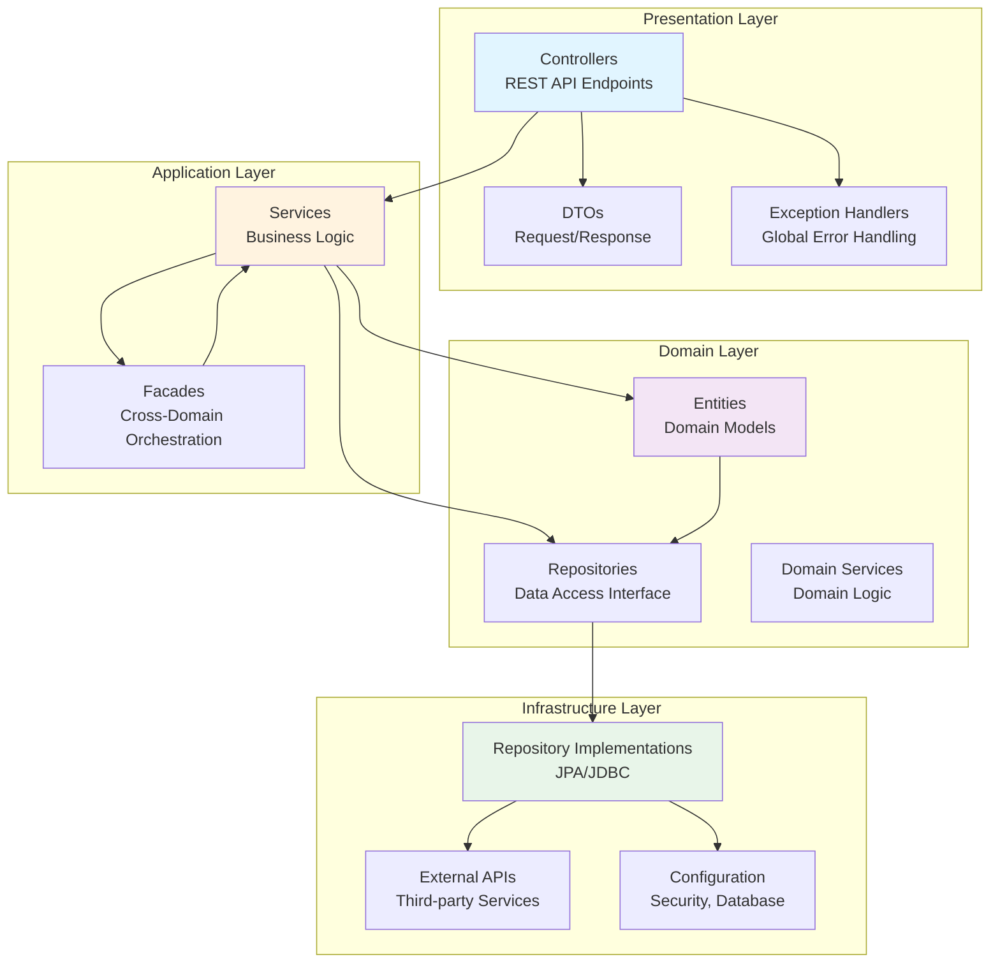

# SCMS Layer Architecture

## 🏗️ 전체 아키텍처 개요

SCMS는 **Modular Monolith** 방식의 **Layered Architecture**를 채택하여, 향후 **MSA 전환**을 준비하는 구조로 설계되었습니다.

---

## 📊 Layer 구조 다이어그램



---

## 🔍 계층별 상세 설명

### 1. Presentation Layer (표현 계층)

**역할:** 클라이언트와의 상호작용 담당

#### 1.1 Controllers
```
src/main/java/com/university/scms/api/controller/
├── AuthController.java           # 인증/인가
├── ProgramController.java        # 비교과 프로그램
├── MileageController.java        # 마일리지
├── CompetencyController.java     # 역량 진단
├── CounselingController.java     # 상담
└── CareerController.java         # 진로 상담
```

**책임:**
- HTTP 요청/응답 처리
- 요청 유효성 검증 (`@Valid`)
- 적절한 HTTP 상태 코드 반환
- Service 계층 호출

**특징:**
- RESTful API 설계 원칙 준수
- 도메인별 Controller 분리
- Thin Controller (비즈니스 로직 없음)

**예시:**
```java
@RestController
@RequestMapping("/api/programs")
@RequiredArgsConstructor
public class ProgramController {
    
    private final ProgramService programService;
    
    @GetMapping
    public ResponseEntity<List<ProgramResponse>> getAllPrograms() {
        return ResponseEntity.ok(programService.getAllPrograms());
    }
    
    @PostMapping
    public ResponseEntity<ProgramResponse> createProgram(
        @Valid @RequestBody ProgramCreateRequest request
    ) {
        return ResponseEntity
            .status(HttpStatus.CREATED)
            .body(programService.createProgram(request));
    }
}
```

#### 1.2 DTOs (Data Transfer Objects)
```
src/main/java/com/university/scms/api/dto/
├── request/
│   ├── ProgramCreateRequest.java
│   ├── ApplicationSubmitRequest.java
│   └── ...
└── response/
    ├── ProgramResponse.java
    ├── ApplicationResponse.java
    └── ...
```

**책임:**
- Entity와 API 간 데이터 변환
- 클라이언트 요청 데이터 캡슐화
- 응답 데이터 구조화

**특징:**
- Entity 직접 노출 방지
- 필요한 필드만 포함
- Validation 어노테이션 활용

#### 1.3 Exception Handlers
```
src/main/java/com/university/scms/api/exception/
├── GlobalExceptionHandler.java
├── BusinessException.java
├── ResourceNotFoundException.java
└── ...
```

**책임:**
- 전역 예외 처리
- 일관된 에러 응답 포맷
- 적절한 HTTP 상태 코드 매핑

---

### 2. Application Layer (응용 계층)

**역할:** 비즈니스 로직 구현 및 트랜잭션 관리

#### 2.1 Services
```
src/main/java/com/university/scms/application/service/
├── AuthService.java
├── ProgramService.java
├── MileageService.java
├── CompetencyService.java
├── CounselingService.java
└── CareerService.java
```

**책임:**
- 비즈니스 로직 구현
- 트랜잭션 관리 (`@Transactional`)
- Repository 계층 호출
- DTO ↔ Entity 변환

**특징:**
- 단일 도메인 내 로직 처리
- 명확한 메서드 시그니처
- 도메인별 Service 분리

**예시:**
```java
@Service
@RequiredArgsConstructor
@Transactional(readOnly = true)
public class ProgramService {
    
    private final ProgramRepository programRepository;
    private final ProgramApplicationRepository applicationRepository;
    
    @Transactional
    public ProgramResponse createProgram(ProgramCreateRequest request) {
        // 1. DTO → Entity 변환
        Program program = Program.builder()
            .name(request.getName())
            .description(request.getDescription())
            .capacity(request.getCapacity())
            .organizerId(request.getOrganizerId())
            .build();
        
        // 2. 비즈니스 로직 실행
        program.open();
        
        // 3. 저장
        Program saved = programRepository.save(program);
        
        // 4. Entity → DTO 변환
        return ProgramResponse.from(saved);
    }
    
    public List<ProgramResponse> getAllPrograms() {
        return programRepository.findAll().stream()
            .map(ProgramResponse::from)
            .toList();
    }
}
```

#### 2.2 Facades (선택적)
```
src/main/java/com/university/scms/application/facade/
├── ProgramApplicationFacade.java
├── MileageRewardFacade.java
└── ...
```

**책임:**
- 여러 도메인 Service 조합
- 크로스 도메인 오케스트레이션
- 복잡한 비즈니스 플로우 관리

**특징:**
- 여러 Service 호출 조율
- 트랜잭션 경계 설정
- MSA 전환 시 Saga 패턴으로 전환 가능

**예시:**
```java
@Service
@RequiredArgsConstructor
public class ProgramApplicationFacade {
    
    private final ProgramService programService;
    private final MileageService mileageService;
    private final NotificationService notificationService;
    
    @Transactional
    public ApplicationResponse applyAndReserveMileage(
        ApplicationRequest request
    ) {
        // 1. 프로그램 신청
        ApplicationResponse application = 
            programService.applyToProgram(request);
        
        // 2. 마일리지 예약 (크로스 도메인)
        mileageService.reservePoints(
            request.getUserId(),
            request.getProgramId(),
            request.getRequiredPoints()
        );
        
        // 3. 알림 발송 (크로스 도메인)
        notificationService.sendApplicationConfirmation(
            request.getUserId(),
            application.getApplicationId()
        );
        
        return application;
    }
}
```

---

### 3. Domain Layer (도메인 계층)

**역할:** 핵심 비즈니스 로직과 도메인 규칙 정의

#### 3.1 Entities
```
src/main/java/com/university/scms/domain/entity/
├── User.java
├── Program.java
├── ProgramApplication.java
├── MileageAccount.java
├── CompetencySurvey.java
└── ...
```

**책임:**
- 도메인 모델 정의
- 비즈니스 규칙 캡슐화
- 상태 변경 메서드 제공
- 도메인 이벤트 발생

**특징:**
- Rich Domain Model (풍부한 도메인 모델)
- 불변성 보장 (Builder 패턴)
- 비즈니스 메서드 포함

**예시:**
```java
@Entity
@Table(name = "programs")
@Getter
@NoArgsConstructor(access = AccessLevel.PROTECTED)
public class Program extends BaseEntity {
    
    @Id
    @GeneratedValue(strategy = GenerationType.IDENTITY)
    private Long id;
    
    private String name;
    private Integer capacity;
    
    @Enumerated(EnumType.STRING)
    private ProgramStatus status;
    
    @OneToMany(mappedBy = "program")
    private List<ProgramApplication> applications = new ArrayList<>();
    
    // 비즈니스 메서드
    public void open() {
        if (this.status != ProgramStatus.DRAFT) {
            throw new IllegalStateException("...");
        }
        this.status = ProgramStatus.OPEN;
    }
    
    public boolean isFull() {
        long approvedCount = applications.stream()
            .filter(app -> app.getStatus() == ApplicationStatus.APPROVED)
            .count();
        return approvedCount >= capacity;
    }
    
    public boolean canApply() {
        return this.status == ProgramStatus.OPEN && !isFull();
    }
}
```

#### 3.2 Repositories (인터페이스)
```
src/main/java/com/university/scms/domain/repository/
├── UserRepository.java
├── ProgramRepository.java
├── MileageAccountRepository.java
└── ...
```

**책임:**
- 데이터 접근 추상화
- 도메인 중심 쿼리 메서드 정의
- JPA Repository 상속

**특징:**
- 인터페이스로 정의 (구현은 Infrastructure)
- Spring Data JPA 활용
- 커스텀 쿼리 메서드 정의

**예시:**
```java
public interface ProgramRepository extends JpaRepository<Program, Long> {
    
    // 상태별 조회
    List<Program> findByStatus(ProgramStatus status);
    
    // 모집 중이고 정원 여유 있는 프로그램
    @Query("SELECT p FROM Program p WHERE p.status = 'OPEN' " +
           "AND SIZE(p.applications) < p.capacity")
    List<Program> findAvailablePrograms();
    
    // 특정 기간 내 프로그램
    List<Program> findByStartDateBetween(
        LocalDateTime start, 
        LocalDateTime end
    );
}
```

#### 3.3 Domain Services (선택적)
```
src/main/java/com/university/scms/domain/service/
├── ProgramDomainService.java
├── MileageCalculationService.java
└── ...
```

**책임:**
- 여러 Entity에 걸친 도메인 로직
- Entity에 포함하기 어려운 로직
- 도메인 규칙 실행

**예시:**
```java
@Component
public class MileageCalculationService {
    
    public Integer calculateEarnedPoints(
        ProgramParticipant participant,
        Program program
    ) {
        // 출석률 기반 계산
        if (participant.getAttendanceStatus() == AttendanceStatus.ATTENDED) {
            return program.getMileageReward();
        }
        return 0;
    }
    
    public boolean canAffordProgram(
        MileageAccount account,
        Integer requiredPoints
    ) {
        return account.getBalance() >= requiredPoints;
    }
}
```

---

### 4. Infrastructure Layer (인프라 계층)

**역할:** 외부 시스템 및 기술 구현 담당

#### 4.1 Repository Implementations
```
src/main/java/com/university/scms/infrastructure/persistence/
└── (Spring Data JPA가 자동 생성)
```

**책임:**
- JPA 구현체 (자동 생성)
- 데이터베이스 연결
- 쿼리 실행

#### 4.2 External APIs
```
src/main/java/com/university/scms/infrastructure/external/
├── EmailClient.java
├── SmsClient.java
└── FileStorageClient.java
```

**책임:**
- 외부 API 호출
- 메시징 시스템 연동
- 파일 저장소 연동

#### 4.3 Configuration
```
src/main/java/com/university/scms/infrastructure/config/
├── SecurityConfig.java
├── JpaConfig.java
├── WebConfig.java
└── ...
```

**책임:**
- Spring 설정
- 보안 설정
- 데이터베이스 설정

---

## 📦 패키지 구조

### 전체 패키지 구조
```
com.university.scms/
├── api/                              # Presentation Layer
│   ├── controller/
│   │   ├── AuthController.java
│   │   ├── ProgramController.java
│   │   ├── MileageController.java
│   │   ├── CompetencyController.java
│   │   ├── CounselingController.java
│   │   └── CareerController.java
│   ├── dto/
│   │   ├── request/
│   │   │   ├── program/
│   │   │   ├── mileage/
│   │   │   └── ...
│   │   └── response/
│   │       ├── program/
│   │       ├── mileage/
│   │       └── ...
│   └── exception/
│       ├── GlobalExceptionHandler.java
│       └── custom exceptions...
│
├── application/                      # Application Layer
│   ├── service/
│   │   ├── AuthService.java
│   │   ├── ProgramService.java
│   │   ├── MileageService.java
│   │   ├── CompetencyService.java
│   │   ├── CounselingService.java
│   │   └── CareerService.java
│   └── facade/
│       ├── ProgramApplicationFacade.java
│       └── MileageRewardFacade.java
│
├── domain/                           # Domain Layer
│   ├── entity/
│   │   ├── User.java
│   │   ├── Program.java
│   │   ├── MileageAccount.java
│   │   └── ...
│   ├── repository/
│   │   ├── UserRepository.java
│   │   ├── ProgramRepository.java
│   │   └── ...
│   ├── service/
│   │   └── domain services...
│   └── common/
│       └── BaseEntity.java
│
└── infrastructure/                   # Infrastructure Layer
    ├── config/
    │   ├── SecurityConfig.java
    │   ├── JpaConfig.java
    │   └── WebConfig.java
    ├── external/
    │   ├── EmailClient.java
    │   └── FileStorageClient.java
    └── persistence/
        └── (JPA implementations)
```

---

## 🔄 계층 간 의존성 규칙

### ✅ 허용되는 의존성
```
Presentation → Application → Domain → Infrastructure
                              ↓
                         Infrastructure
```

### ❌ 금지되는 의존성
```
Domain → Application  (X)
Domain → Presentation (X)
Application → Presentation (X)
```

### 의존성 규칙 상세

1. **Presentation Layer**
   - Application Layer 의존 ✅
   - Domain Layer 직접 접근 ❌

2. **Application Layer**
   - Domain Layer 의존 ✅
   - Infrastructure Layer 의존 ✅ (필요시)
   - Presentation Layer 의존 ❌

3. **Domain Layer**
   - 다른 계층 의존 ❌
   - 완전히 독립적
   - 순수한 비즈니스 로직만

4. **Infrastructure Layer**
   - Domain Layer 의존 ✅ (구현)
   - 다른 계층 의존 ❌

---

## 🎯 MSA 전환 준비

### Modular Monolith → MSA

현재 Layered Architecture는 MSA 전환을 고려하여 설계되었습니다.

#### 도메인별 분리 가능성
```
현재 구조:
com.university.scms/
├── api/controller/
│   ├── ProgramController      → Program Service
│   └── MileageController      → Mileage Service
├── application/service/
│   ├── ProgramService         → Program Service
│   └── MileageService         → Mileage Service
└── domain/
    ├── Program               → Program Service
    └── MileageAccount        → Mileage Service

MSA 전환 후:
program-service/
├── api/controller/ProgramController
├── application/service/ProgramService
└── domain/entity/Program

mileage-service/
├── api/controller/MileageController
├── application/service/MileageService
└── domain/entity/MileageAccount
```

#### 크로스 도메인 통신
현재: Direct Method Call
```java
// Application Layer
programService.applyToProgram();
mileageService.reservePoints();  // 같은 JVM 내
```

MSA 전환 후: REST API / Message Queue
```java
// REST API
restTemplate.post("/mileage-service/api/points/reserve");

// 또는 Message Queue
kafkaTemplate.send("mileage.reserve", reserveEvent);
```

---

## 💡 Best Practices

### 1. Controller (Presentation)
```java
// ✅ Good - Thin Controller
@PostMapping
public ResponseEntity<ProgramResponse> create(
    @Valid @RequestBody ProgramCreateRequest request
) {
    return ResponseEntity
        .status(HttpStatus.CREATED)
        .body(programService.createProgram(request));
}

// ❌ Bad - Fat Controller (비즈니스 로직 포함)
@PostMapping
public ResponseEntity<ProgramResponse> create(
    @Valid @RequestBody ProgramCreateRequest request
) {
    Program program = new Program();
    program.setName(request.getName());
    program.setStatus(ProgramStatus.DRAFT);
    program.open();  // 비즈니스 로직
    programRepository.save(program);  // 직접 저장
    return ResponseEntity.ok(ProgramResponse.from(program));
}
```

### 2. Service (Application)
```java
// ✅ Good - 명확한 책임
@Transactional
public ProgramResponse createProgram(ProgramCreateRequest request) {
    Program program = mapToEntity(request);
    program.open();
    Program saved = programRepository.save(program);
    return ProgramResponse.from(saved);
}

// ❌ Bad - 여러 책임 혼재
@Transactional
public ProgramResponse createProgram(ProgramCreateRequest request) {
    // DTO 검증 (Controller 책임)
    if (request.getCapacity() < 0) throw new Exception();
    
    // Entity 생성
    Program program = mapToEntity(request);
    
    // 외부 API 호출 (Infrastructure 책임)
    emailClient.sendEmail();
    
    // 로깅 (Infrastructure 책임)
    log.info("Created program");
    
    return ProgramResponse.from(program);
}
```

### 3. Entity (Domain)
```java
// ✅ Good - Rich Domain Model
public void complete() {
    if (this.status != ProgramStatus.IN_PROGRESS) {
        throw new IllegalStateException("...");
    }
    this.status = ProgramStatus.COMPLETED;
    this.completedAt = LocalDateTime.now();
}

// ❌ Bad - Anemic Domain Model (빈약한 도메인 모델)
// Setter만 있고 비즈니스 로직 없음
public void setStatus(ProgramStatus status) {
    this.status = status;
}
```

---

## 📋 체크리스트

### Controller 작성 시
- [ ] Thin Controller 원칙 준수
- [ ] DTO 사용 (Entity 노출 금지)
- [ ] `@Valid`로 요청 검증
- [ ] 적절한 HTTP 상태 코드 반환
- [ ] Service 계층에만 의존

### Service 작성 시
- [ ] `@Transactional` 적절히 사용
- [ ] 단일 도메인 로직만 포함
- [ ] DTO ↔ Entity 변환 처리
- [ ] 예외 처리 명확히
- [ ] Repository 통해서만 데이터 접근

### Entity 작성 시
- [ ] 비즈니스 메서드 포함
- [ ] Setter 최소화
- [ ] Builder 패턴 사용
- [ ] 불변성 보장
- [ ] 도메인 규칙 캡슐화

---

**작성일**: 2025-01-XX  
**최종 수정**: 2025-01-XX  
**다음 문서**: API 명세서 작성 예정
