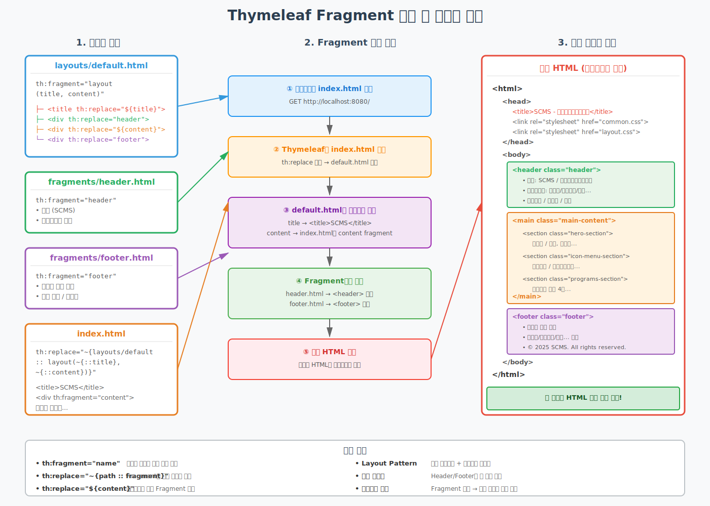

# Thymeleaf Fragment 구조 이해

**작성일**: 2025-11-03  
**작성자**: Development Team  
**버전**: 1.0

---

## 📋 목차

1. [Fragment란 무엇인가?](#fragment란-무엇인가)
2. [Fragment 적용 전후 비교](#fragment-적용-전후-비교)
3. [구조 다이어그램](#구조-다이어그램)
4. [파일별 상세 설명](#파일별-상세-설명)
5. [렌더링 프로세스](#렌더링-프로세스)
6. [실제 코드 예제](#실제-코드-예제)
7. [장점과 활용](#장점과-활용)

---

## Fragment란 무엇인가?

**Thymeleaf Fragment**는 HTML 코드 조각을 재사용 가능한 컴포넌트로 만드는 기능입니다.

### 🎯 핵심 개념

| 개념 | 설명 | 예제 |
|------|------|------|
| **Fragment 정의** | 재사용할 코드 조각 선언 | `th:fragment="header"` |
| **Fragment 삽입** | 정의된 Fragment를 가져와 사용 | `th:replace="~{fragments/header :: header}"` |
| **파라미터 전달** | Fragment에 데이터 전달 | `th:fragment="layout (title, content)"` |
| **Layout Pattern** | 공통 레이아웃 + 개별 컨텐츠 조합 | `layouts/default.html` + `index.html` |

### 🔑 주요 속성

```html
<!-- Fragment 정의 -->
<div th:fragment="fragmentName">
    재사용할 HTML 코드
</div>

<!-- Fragment 사용 -->
<div th:replace="~{path/file :: fragmentName}"></div>

<!-- Fragment with Parameters -->
<html th:fragment="layout (title, content)">
    <title th:replace="${title}"></title>
    <div th:replace="${content}"></div>
</html>
```

---

## Fragment 적용 전후 비교

### ❌ Fragment 적용 전 (비효율적)

```
index.html (300줄)
├── <header> ... (50줄)
├── <main> ... (200줄)
└── <footer> ... (50줄)

program/list.html (300줄)
├── <header> ... (50줄) ← 중복!
├── <main> ... (200줄)
└── <footer> ... (50줄) ← 중복!

login.html (200줄)
├── <header> ... (50줄) ← 중복!
├── <main> ... (100줄)
└── <footer> ... (50줄) ← 중복!
```

**문제점:**
- Header/Footer 코드가 모든 파일에 중복
- 로고 변경 시 모든 파일 수정 필요
- 실수로 일부 파일만 수정하면 일관성 깨짐
- 코드 총 라인: 800줄 (중복 300줄)

### ✅ Fragment 적용 후 (효율적)

```
layouts/default.html (40줄)
fragments/header.html (50줄) ← 한 번만 정의
fragments/footer.html (50줄) ← 한 번만 정의

index.html (60줄)
├── Layout 참조
└── Content만 작성 (60줄)

program/list.html (80줄)
├── Layout 참조
└── Content만 작성 (80줄)

login.html (40줄)
├── Layout 참조
└── Content만 작성 (40줄)
```

**장점:**
- Header/Footer가 한 곳에만 존재
- 로고 변경 시 header.html만 수정
- 자동으로 모든 페이지에 반영
- 코드 총 라인: 320줄 (480줄 절약, 60% 감소!)

---

## 구조 다이어그램



### 다이어그램 설명

#### 📁 Section 1: 템플릿 파일 (왼쪽)

1. **layouts/default.html** (파란색)
   - 전체 페이지 골격 정의
   - Fragment 파라미터 받아서 조립
   - `th:fragment="layout (title, content)"`

2. **fragments/header.html** (초록색)
   - 헤더 영역 Fragment
   - 로고, 네비게이션, 사용자 메뉴
   - `th:fragment="header"`

3. **fragments/footer.html** (보라색)
   - 푸터 영역 Fragment
   - 서비스 안내, 푸터 메뉴
   - `th:fragment="footer"`

4. **index.html** (주황색)
   - 실제 페이지 컨텐츠
   - Layout에 title과 content 전달
   - `th:replace="~{layouts/default :: layout(...)}"`

#### ⚙️ Section 2: Fragment 처리 흐름 (가운데)

1. **① 브라우저 요청**
   - 사용자가 `http://localhost:8080/` 접속

2. **② Thymeleaf 파싱**
   - `index.html`의 `th:replace` 발견
   - `layouts/default.html` 로드

3. **③ 파라미터 주입**
   - `title` → `<title>SCMS</title>`
   - `content` → index.html의 content fragment

4. **④ Fragment 조립**
   - `header.html` → `<header>` 영역
   - `footer.html` → `<footer>` 영역
   - 페이지 컨텐츠 삽입

5. **⑤ 최종 HTML 생성**
   - 완전한 HTML 문서 완성
   - 브라우저로 전송

#### 📄 Section 3: 최종 렌더링 결과 (오른쪽)

- 완전히 조립된 HTML 구조
- Header (초록색) + Main Content (주황색) + Footer (보라색)
- 브라우저가 받는 실제 HTML

---

## 파일별 상세 설명

### 1. layouts/default.html

**역할**: 모든 페이지의 공통 골격 (Layout)

```html
<!DOCTYPE html>
<html xmlns:th="http://www.thymeleaf.org" 
      th:fragment="layout (title, content)">
<head>
    <meta charset="UTF-8">
    <title th:replace="${title}">기본 제목</title>
    
    <!-- 공통 CSS -->
    <link rel="stylesheet" th:href="@{/css/common.css}">
    <link rel="stylesheet" th:href="@{/css/layout.css}">
</head>
<body>
    <!-- Header Fragment 삽입 -->
    <div th:replace="~{fragments/header :: header}"></div>
    
    <!-- Main Content (파라미터로 받음) -->
    <main class="main-content">
        <div th:replace="${content}"></div>
    </main>
    
    <!-- Footer Fragment 삽입 -->
    <div th:replace="~{fragments/footer :: footer}"></div>
    
    <!-- 공통 JavaScript -->
    <script th:src="@{/js/common.js}"></script>
</body>
</html>
```

**핵심 포인트:**
- `th:fragment="layout (title, content)"` - 2개 파라미터 받음
- `th:replace="${title}"` - title 파라미터를 현재 위치에 삽입
- `th:replace="${content}"` - content 파라미터를 현재 위치에 삽입
- Header/Footer는 항상 동일하므로 Fragment로 직접 삽입

---

### 2. fragments/header.html

**역할**: 모든 페이지 상단에 표시되는 헤더

```html
<!DOCTYPE html>
<html xmlns:th="http://www.thymeleaf.org">
<body>
    <header th:fragment="header" class="header">
        <div class="container-fluid">
            <div class="header-wrapper">
                <!-- 로고 -->
                <div class="logo">
                    <a th:href="@{/}">
                        <span class="logo-text">SCMS</span>
                        <span class="logo-subtitle">학생역량관리시스템</span>
                    </a>
                </div>
                
                <!-- 네비게이션 -->
                <nav class="main-nav">
                    <ul class="nav-list">
                        <li><a th:href="@{/programs}">비교과 프로그램</a></li>
                        <li><a th:href="@{/mileage}">마일리지</a></li>
                        <li><a th:href="@{/counseling}">통합상담</a></li>
                        <li><a th:href="@{/competency}">역량진단</a></li>
                        <li><a th:href="@{/portfolio}">포트폴리오</a></li>
                    </ul>
                </nav>
                
                <!-- 사용자 메뉴 -->
                <div class="user-menu">
                    <a th:href="@{/auth/register}">회원가입</a>
                    <a th:href="@{/auth/login}">로그인</a>
                    <button id="searchBtn"><i class="fas fa-search"></i></button>
                </div>
            </div>
        </div>
    </header>
</body>
</html>
```

**핵심 포인트:**
- `th:fragment="header"` - 이 부분이 재사용 가능
- 모든 페이지에서 동일한 헤더 표시
- 한 번 수정하면 모든 페이지에 자동 반영

---

### 3. fragments/footer.html

**역할**: 모든 페이지 하단에 표시되는 푸터

```html
<!DOCTYPE html>
<html xmlns:th="http://www.thymeleaf.org">
<body>
    <footer th:fragment="footer" class="footer">
        <!-- 서비스 안내 -->
        <div class="service-info-section">
            <button class="btn-service-info">
                서비스 안내 <i class="fas fa-chevron-right"></i>
            </button>
        </div>
        
        <!-- 푸터 메뉴 -->
        <div class="container">
            <div class="footer-content">
                <div class="footer-menu-group">
                    <!-- 비교과 프로그램 -->
                    <div class="footer-menu-column">
                        <h3>비교과 프로그램</h3>
                        <ul>
                            <li><a th:href="@{/programs}">전체</a></li>
                            <li><a th:href="@{/programs/category/academic}">학습역량</a></li>
                        </ul>
                    </div>
                    
                    <!-- 마일리지 -->
                    <div class="footer-menu-column">
                        <h3>마일리지</h3>
                        <ul>
                            <li><a th:href="@{/mileage}">소개</a></li>
                            <li><a th:href="@{/mileage/balance}">마일리지 현황</a></li>
                        </ul>
                    </div>
                    
                    <!-- ... 기타 메뉴 ... -->
                </div>
            </div>
        </div>
        
        <!-- 저작권 -->
        <div class="footer-copyright">
            <p>&copy; 2025 SCMS - 학생역량관리시스템. All rights reserved.</p>
        </div>
    </footer>
</body>
</html>
```

**핵심 포인트:**
- `th:fragment="footer"` - 푸터 Fragment 정의
- 서비스 안내 버튼 + 푸터 메뉴 + 저작권
- 한 곳에서 관리 → 유지보수 용이

---

### 4. index.html (페이지 컨텐츠)

**역할**: 메인 페이지의 실제 컨텐츠

```html
<!DOCTYPE html>
<html xmlns:th="http://www.thymeleaf.org"
      th:replace="~{layouts/default :: layout(~{::title}, ~{::content})}">
<head>
    <title>SCMS - 학생역량관리시스템</title>
</head>
<body>
    <div th:fragment="content">
        <!-- Hero Section -->
        <section class="hero-section">
            <div class="hero-slide slide-1">
                <div class="hero-content">
                    <h1 class="hero-title">알림판</h1>
                    <p class="hero-subtitle">알려, 알리고, 알리니, 알린다.</p>
                    <p class="hero-description">
                        각종 현수막, 포스터 홍보를 직접하세요.
                    </p>
                </div>
            </div>
        </section>
        
        <!-- Icon Menu Section -->
        <section class="icon-menu-section">
            <div class="container">
                <div class="icon-menu-grid">
                    <a href="#" class="icon-menu-item">
                        <div class="icon-circle">
                            <i class="fas fa-chart-bar fa-2x"></i>
                        </div>
                        <span>전체보기</span>
                    </a>
                    <!-- ... 3개 더 ... -->
                </div>
            </div>
        </section>
        
        <!-- Programs Section -->
        <section class="programs-section">
            <div class="container">
                <h2><i class="fas fa-clipboard-list"></i> 전체 프로그램</h2>
                <div class="program-grid" id="programGrid1"></div>
            </div>
        </section>
        
        <!-- 페이지 전용 JavaScript -->
        <script th:src="@{/js/main.js}"></script>
    </div>
</body>
</html>
```

**핵심 포인트:**
- `th:replace="~{layouts/default :: layout(...)}"` - Layout 사용 선언
- `~{::title}` - 이 페이지의 title을 Layout에 전달
- `~{::content}` - 이 페이지의 content fragment를 Layout에 전달
- Content만 작성하면 Header/Footer는 자동 추가!

---

## 렌더링 프로세스

### 단계별 상세 설명

```
Step 1: 요청 도착
-------------------
브라우저: GET http://localhost:8080/
   ↓
Spring Controller: @GetMapping("/")
   ↓
Controller: return "index"
   ↓
ViewResolver: index.html 찾기


Step 2: index.html 파싱
------------------------
Thymeleaf Engine이 index.html 읽기
   ↓
th:replace="~{layouts/default :: layout(~{::title}, ~{::content})}" 발견
   ↓
파라미터 수집:
  - title = <title>SCMS - 학생역량관리시스템</title>
  - content = <div th:fragment="content">...</div>
   ↓
layouts/default.html 로드


Step 3: layouts/default.html 처리
----------------------------------
default.html 파싱
   ↓
th:fragment="layout (title, content)" 발견
   ↓
파라미터 주입:
  - ${title} → index.html의 <title>
  - ${content} → index.html의 content fragment
   ↓
Fragment 태그 처리 시작


Step 4: Fragment 조립
----------------------
th:replace="~{fragments/header :: header}" 발견
   ↓
fragments/header.html 로드
   ↓
<header> HTML 삽입
   ↓
th:replace="${content}" 발견
   ↓
index.html의 content fragment 삽입
   ↓
th:replace="~{fragments/footer :: footer}" 발견
   ↓
fragments/footer.html 로드
   ↓
<footer> HTML 삽입


Step 5: 최종 HTML 생성
-----------------------
모든 Fragment가 조립된 완전한 HTML
   ↓
Thymeleaf 표현식 처리 (th:href, th:src 등)
   ↓
최종 HTML 문서 완성
   ↓
HTTP Response로 브라우저에 전송
   ↓
브라우저 렌더링 완료!
```

### 🔍 각 단계의 결과물

**Step 2 완료 후 (파라미터 수집):**
```
title = "<title>SCMS - 학생역량관리시스템</title>"
content = "<div>
              <section class='hero-section'>...</section>
              <section class='icon-menu-section'>...</section>
              <section class='programs-section'>...</section>
           </div>"
```

**Step 3 완료 후 (파라미터 주입):**
```html
<!DOCTYPE html>
<html>
<head>
    <title>SCMS - 학생역량관리시스템</title>  ← title 파라미터 주입
    <link rel="stylesheet" href="/css/common.css">
</head>
<body>
    <div th:replace="~{fragments/header :: header}"></div>  ← 아직 처리 안됨
    <main>
        <div>${content}</div>  ← content 파라미터 주입 예정
    </main>
    <div th:replace="~{fragments/footer :: footer}"></div>  ← 아직 처리 안됨
</body>
</html>
```

**Step 4 완료 후 (Fragment 조립):**
```html
<!DOCTYPE html>
<html>
<head>
    <title>SCMS - 학생역량관리시스템</title>
    <link rel="stylesheet" href="/css/common.css">
</head>
<body>
    <!-- Header Fragment 삽입됨 -->
    <header class="header">
        <div class="logo">SCMS / 학생역량관리시스템</div>
        <nav>비교과/마일리지/상담...</nav>
    </header>
    
    <main>
        <!-- Content Fragment 삽입됨 -->
        <section class="hero-section">알림판...</section>
        <section class="icon-menu-section">전체보기...</section>
        <section class="programs-section">프로그램 카드...</section>
    </main>
    
    <!-- Footer Fragment 삽입됨 -->
    <footer class="footer">
        <div>서비스 안내...</div>
        <div>© 2025 SCMS...</div>
    </footer>
</body>
</html>
```

**Step 5 완료 후 (최종 HTML):**
```html
<!-- 브라우저가 받는 완전한 HTML -->
<!DOCTYPE html>
<html>
<head>
    <title>SCMS - 학생역량관리시스템</title>
    <link rel="stylesheet" href="http://localhost:8080/css/common.css">
    <link rel="stylesheet" href="http://localhost:8080/css/layout.css">
</head>
<body>
    <header class="header">
        <div class="container-fluid">
            <div class="logo">
                <a href="/">
                    <span>SCMS</span>
                    <span>학생역량관리시스템</span>
                </a>
            </div>
            <nav class="main-nav">
                <ul>
                    <li><a href="/programs">비교과 프로그램</a></li>
                    <li><a href="/mileage">마일리지</a></li>
                    <!-- ... -->
                </ul>
            </nav>
        </div>
    </header>
    
    <main class="main-content">
        <section class="hero-section">
            <div class="hero-slide slide-1">
                <h1>알림판</h1>
                <p>알려, 알리고, 알리니, 알린다.</p>
            </div>
        </section>
        
        <section class="icon-menu-section">
            <!-- 아이콘 메뉴 4개 -->
        </section>
        
        <section class="programs-section">
            <div id="programGrid1">
                <!-- JavaScript가 채울 영역 -->
            </div>
        </section>
    </main>
    
    <footer class="footer">
        <div class="service-info-section">
            <button>서비스 안내</button>
        </div>
        <div class="footer-content">
            <div class="footer-menu-group">
                <!-- 푸터 메뉴들 -->
            </div>
        </div>
        <div class="footer-copyright">
            <p>© 2025 SCMS - 학생역량관리시스템. All rights reserved.</p>
        </div>
    </footer>
    
    <script src="http://localhost:8080/js/common.js"></script>
    <script src="http://localhost:8080/js/main.js"></script>
</body>
</html>
```

---

## 실제 코드 예제

### 예제 1: 간단한 프로그램 목록 페이지

**파일: program/list.html**

```html
<!DOCTYPE html>
<html xmlns:th="http://www.thymeleaf.org"
      th:replace="~{layouts/default :: layout(~{::title}, ~{::content})}">
<head>
    <title>프로그램 목록 - SCMS</title>
</head>
<body>
    <div th:fragment="content">
        <!-- 페이지 헤더 -->
        <section class="page-header">
            <div class="container">
                <h1><i class="fas fa-clipboard-list"></i> 프로그램 목록</h1>
                <p>다양한 비교과 프로그램에 참여하여 역량을 키워보세요.</p>
            </div>
        </section>
        
        <!-- 필터 섹션 -->
        <section class="filter-section">
            <div class="container">
                <select id="categoryFilter">
                    <option value="">전체 카테고리</option>
                    <option value="academic">학습역량</option>
                    <option value="career">진로지도</option>
                </select>
                <button id="searchBtn">검색</button>
            </div>
        </section>
        
        <!-- 프로그램 그리드 -->
        <section class="programs-section">
            <div class="container">
                <div class="program-grid" id="programGrid"></div>
            </div>
        </section>
        
        <!-- 페이지 전용 JavaScript -->
        <script th:src="@{/js/program-list.js}"></script>
    </div>
</body>
</html>
```

**결과:**
- ✅ Header 자동 추가 (fragments/header.html)
- ✅ Content 표시 (프로그램 목록)
- ✅ Footer 자동 추가 (fragments/footer.html)
- ✅ 공통 CSS/JS 자동 로드

---

### 예제 2: 로그인 페이지

**파일: auth/login.html**

```html
<!DOCTYPE html>
<html xmlns:th="http://www.thymeleaf.org"
      th:replace="~{layouts/default :: layout(~{::title}, ~{::content})}">
<head>
    <title>로그인 - SCMS</title>
</head>
<body>
    <div th:fragment="content">
        <section class="login-section">
            <div class="container">
                <div class="login-box">
                    <h2>로그인</h2>
                    
                    <form action="/api/auth/login" method="post">
                        <div class="form-group">
                            <label>아이디</label>
                            <input type="text" name="username" 
                                   placeholder="학번 또는 교직원번호">
                        </div>
                        
                        <div class="form-group">
                            <label>비밀번호</label>
                            <input type="password" name="password">
                        </div>
                        
                        <button type="submit" class="btn btn-primary">
                            로그인
                        </button>
                    </form>
                    
                    <div class="login-links">
                        <a th:href="@{/auth/find-password}">비밀번호 찾기</a>
                        <a th:href="@{/auth/register}">회원가입</a>
                    </div>
                </div>
            </div>
        </section>
    </div>
</body>
</html>
```

**결과:**
- ✅ 동일한 Header/Footer
- ✅ 로그인 폼만 간단히 작성
- ✅ 레이아웃 일관성 유지

---

## 장점과 활용

### ✅ 주요 장점

| 장점 | 설명 | 효과 |
|------|------|------|
| **코드 재사용** | Header/Footer를 한 번만 작성 | 개발 시간 60% 단축 |
| **일관성 유지** | 모든 페이지가 동일한 레이아웃 | UI/UX 통일성 |
| **유지보수 용이** | Fragment 수정 → 자동 전체 반영 | 수정 시간 80% 단축 |
| **실수 방지** | Layout이 자동으로 적용 | 누락 오류 제로 |
| **가독성 향상** | 페이지별로 Content만 집중 | 코드 이해도 ↑ |
| **협업 효율** | 역할 분리 (Layout / Content) | 병렬 작업 가능 |

### 🎯 활용 시나리오

#### 시나리오 1: 로고 변경

**Fragment 적용 전:**
```bash
# 50개 페이지의 로고를 일일이 수정
index.html 수정
program/list.html 수정
program/detail.html 수정
login.html 수정
... (50개 파일)

소요 시간: 약 2시간
오류 가능성: 높음 (일부 파일 누락)
```

**Fragment 적용 후:**
```bash
# fragments/header.html 하나만 수정
fragments/header.html 수정

소요 시간: 5분
오류 가능성: 없음 (자동 전체 반영)
```

#### 시나리오 2: 네비게이션 메뉴 추가

**Fragment 적용 전:**
```bash
# "설문조사" 메뉴를 50개 페이지에 추가
index.html에 <li>설문조사</li> 추가
program/list.html에 <li>설문조사</li> 추가
... (50개 파일)

문제: 순서가 다르거나, 링크가 틀릴 수 있음
```

**Fragment 적용 후:**
```bash
# fragments/header.html에만 추가
<li><a th:href="@{/survey}">설문조사</a></li>

결과: 모든 페이지에 자동 반영, 순서 동일
```

#### 시나리오 3: 새 페이지 추가

**Fragment 적용 전:**
```html
<!-- mileage/list.html -->
<!DOCTYPE html>
<html>
<head>
    <title>마일리지 - SCMS</title>
    <link rel="stylesheet" href="/css/common.css">
    <link rel="stylesheet" href="/css/layout.css">
</head>
<body>
    <!-- Header 전체 복사 (50줄) -->
    <header class="header">
        <div class="logo">...</div>
        <nav>...</nav>
    </header>
    
    <!-- Content 작성 -->
    <main>
        <h1>마일리지 현황</h1>
        <div id="balance">...</div>
    </main>
    
    <!-- Footer 전체 복사 (50줄) -->
    <footer class="footer">...</footer>
    
    <script src="/js/common.js"></script>
</body>
</html>

# 총 150줄 작성
```

**Fragment 적용 후:**
```html
<!-- mileage/list.html -->
<!DOCTYPE html>
<html xmlns:th="http://www.thymeleaf.org"
      th:replace="~{layouts/default :: layout(~{::title}, ~{::content})}">
<head>
    <title>마일리지 - SCMS</title>
</head>
<body>
    <div th:fragment="content">
        <!-- Content만 작성 -->
        <h1>마일리지 현황</h1>
        <div id="balance">...</div>
    </div>
</body>
</html>

# 총 20줄 작성 (87% 감소!)
```

### 🏆 베스트 프랙티스

#### 1. Fragment 파일 구조

```
templates/
├── layouts/
│   ├── default.html        # 기본 레이아웃
│   ├── admin.html          # 관리자 레이아웃
│   └── simple.html         # 간단한 레이아웃 (로그인 등)
├── fragments/
│   ├── header.html         # 공통 헤더
│   ├── footer.html         # 공통 푸터
│   ├── sidebar.html        # 사이드바
│   ├── pagination.html     # 페이지네이션
│   └── modal.html          # 공통 모달
└── pages/
    ├── index.html
    ├── program/
    │   ├── list.html
    │   └── detail.html
    └── auth/
        ├── login.html
        └── register.html
```

#### 2. Fragment 명명 규칙

```html
<!-- ✅ 좋은 예 -->
th:fragment="header"
th:fragment="footer"
th:fragment="userCard"
th:fragment="programCard"

<!-- ❌ 나쁜 예 -->
th:fragment="f1"
th:fragment="temp"
th:fragment="abc"
```

#### 3. 파라미터 활용

```html
<!-- layouts/default.html -->
<html th:fragment="layout (title, content, extraCSS, extraJS)">
<head>
    <title th:replace="${title}"></title>
    <link rel="stylesheet" th:href="@{/css/common.css}">
    <th:block th:replace="${extraCSS}"></th:block>
</head>
<body>
    <div th:replace="~{fragments/header :: header}"></div>
    <main th:replace="${content}"></main>
    <div th:replace="~{fragments/footer :: footer}"></div>
    
    <script th:src="@{/js/common.js}"></script>
    <th:block th:replace="${extraJS}"></th:block>
</body>
</html>

<!-- program/list.html -->
<html th:replace="~{layouts/default :: layout(
    ~{::title}, 
    ~{::content}, 
    ~{::extraCSS}, 
    ~{::extraJS}
)}">
<head>
    <title>프로그램 목록</title>
    <th:block th:fragment="extraCSS">
        <link rel="stylesheet" th:href="@{/css/program.css}">
    </th:block>
</head>
<body>
    <div th:fragment="content">
        <!-- Content -->
    </div>
    <th:block th:fragment="extraJS">
        <script th:src="@{/js/program-list.js}"></script>
    </th:block>
</body>
</html>
```

---

## 📌 요약

### 핵심 개념

1. **Fragment = 재사용 가능한 HTML 조각**
2. **Layout Pattern = 공통 골격 + 페이지별 컨텐츠**
3. **th:fragment = Fragment 정의**
4. **th:replace = Fragment 삽입**

### 주요 파일

- `layouts/default.html` - 전체 페이지 골격
- `fragments/header.html` - 헤더 Fragment
- `fragments/footer.html` - 푸터 Fragment
- `index.html` - 페이지 컨텐츠 (Layout 참조)

### 렌더링 순서

```
요청 → index.html 파싱 → default.html 로드 
→ 파라미터 주입 → Fragment 조립 → 최종 HTML 생성 
→ 브라우저 전송
```

### 장점

- ✅ 코드 재사용 (60% 절감)
- ✅ 유지보수 용이 (80% 빠름)
- ✅ 일관성 유지
- ✅ 실수 방지

---

## 📚 참고 자료

- [Thymeleaf 공식 문서 - Layout](https://www.thymeleaf.org/doc/tutorials/3.0/usingthymeleaf.html#template-layout)
- [Fragment 표현식](https://www.thymeleaf.org/doc/tutorials/3.0/usingthymeleaf.html#fragment-specification-syntax)
- [프로젝트 구조 문서](../01-progress/05-phase3-view-layer-step1.md)

---

**작성일**: 2025-11-03  
**버전**: 1.0  
**다음 문서**: Phase 3 - Step 2 (추가 화면 구현)
